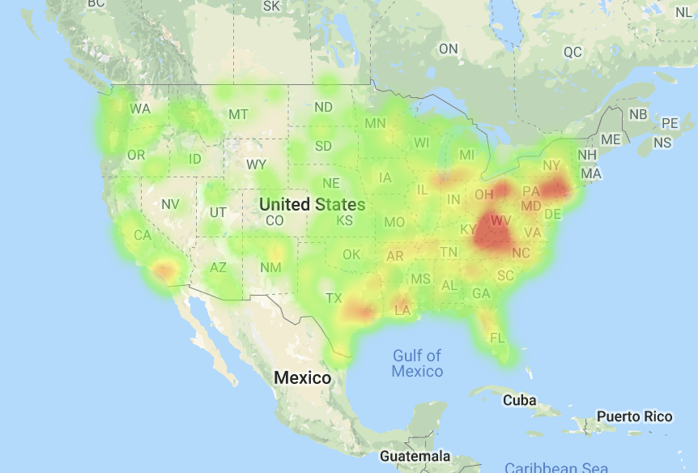
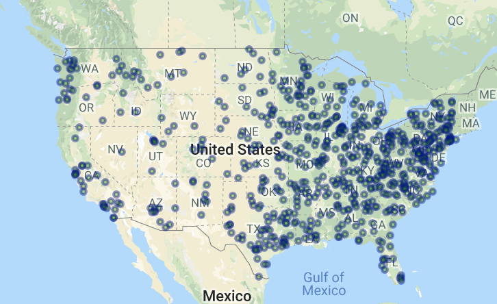
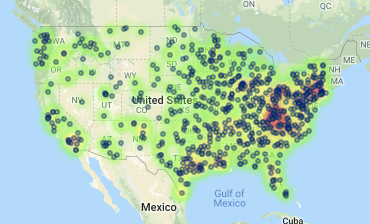

# Banking Deserts Heatmap

* In this activity your broad task is to answer the question: "What is the relationship between poverty, age, and population with the number of banks in a given area?" To help accomplish this task, you've been given census data for every zip code across the country. We will also visualize this data by creating layered maps with Google maps.

## Instructions

* Using [zip_bank_data.csv](Resources/zip_bank_data.csv) and your new knowledge of the US Census API, add a column for Poverty Rate to the csv.

* Using `gmap` create the following three figures:

  * A map with a `heatmap_layer` of the poverty rate for each city.
    

  * A map with a `symbol_layer` for the number of banks located at that city.
    

  * A map that includes both the poverty `heatmap_layer` and the bank `symbol_layer`.
    

### Hints

* Test your code with only 5-10 cities at a time while debugging your code.

* For reference, use the docs for the [layers](http://jupyter-gmaps.readthedocs.io/en/latest/api.html#figures-and-layers) and as a [refresher](http://jupyter-gmaps.readthedocs.io/en/latest/tutorial.html) for setting up the maps.

* Be sure to handle zoom on the heat map.

* At this point, you should not need to perform any new requests to Google's APIs.

* To format the info boxes on your symbol_layer, look to use string formatting with list comprehension.
