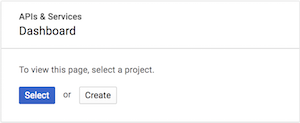
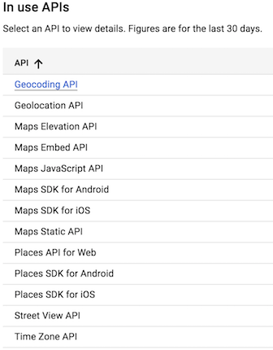
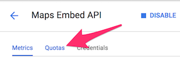
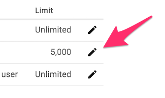

# Setting Google API Daily Usage Caps

As of June 16, 2018, Google is adjusting their pricing for the Google Maps Platform to require a credit card on file. They do charge for the platform, but provide a $200 credit for those services.

To avoid an unexpected increase in usage limits, the following walk-through will assist with setting up a maximum daily billable limit for your API calls.

- - -

1. Visit the [Google Dashboard](https://console.cloud.google.com/projectselector/apis/dashboard?_ga=2.166576887.87610002.1528936935-349962923.1526573906&supportedpurview=project).
2. Select a project (if prompted).
  
3. Once you have selected a project, select an API from your API list and navigate to the quotas tab.
  
  
4. Finally, click the edit icon next to the "requests per day" quota to make the necessary changes.
  

* **Note**: These steps will need to be repeated for each API in use.

- - -

Full documentation regarding the pricing change can be found within this [Google FAQ](https://developers.google.com/maps/faq).

To set up a budget and/or billing alerts, visit the [Google Cloud Billing Documentation](https://cloud.google.com/billing/docs/how-to/budgets).
